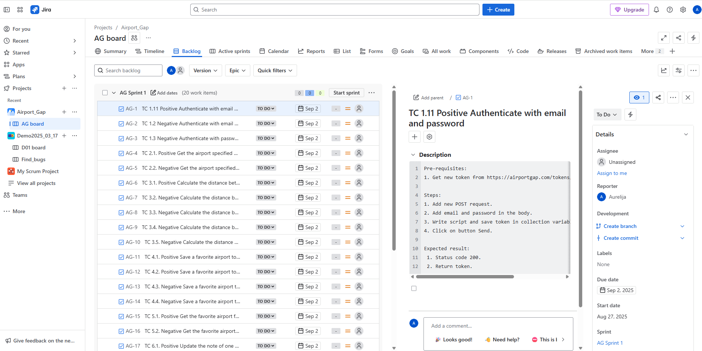
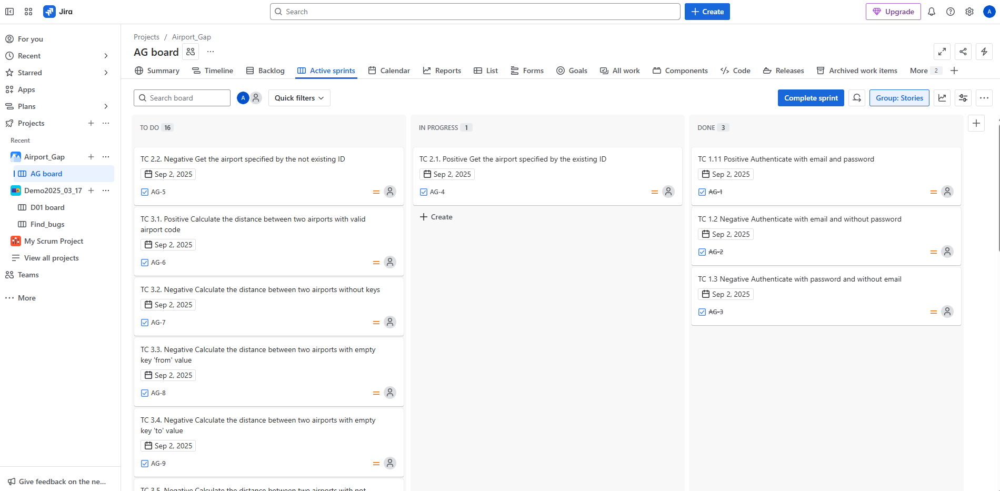
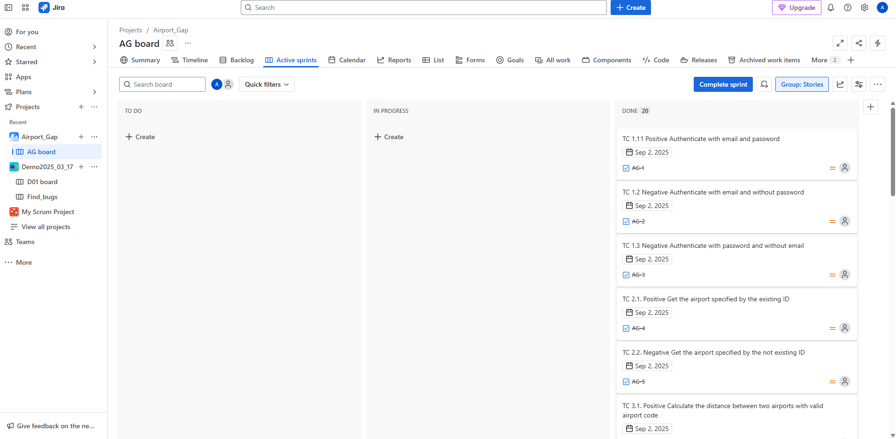

## Working Process with Jira Board – Airport_Gap Project
### Overview

This document outlines the workflow used in the AG board (Airport_Gap project) within Jira. It includes managing the backlog, sprint planning, task assignment, progress tracking, and completion monitoring.

### 1. Backlog Management

The Backlog section contains all test cases (TCs) organized by Sprint (e.g., AG Sprint 1).

Each task follows a consistent naming convention:
```bash
TC <test senario number>.<test cases number> <Test case title>
```

Each test case includes:

- A clear description
- Pre-requisites
- Steps to execute
- Expected results

### 2. Task Details

Clicking on a task reveals:

- A detailed test case description
- Assignee field (can be assigned manually)
- Reporter information
- Development options (e.g., create branch/commit)
- Due date (e.g., Sep 2, 2025)
- Sprint assignment (e.g., AG Sprint 1)



### 3. Sprint Workflow

### Columns in the Active Sprint Board:

- To Do – tasks not yet started.
- In Progress – tasks currently being worked on.
- Done – completed tasks with test cases executed and results verified.

### Sprint Example:



### 4. Completion Tracking

- After task execution and validation, cards are moved to the Done column.
- The board visually reflects real-time progress.
- Sprint can be completed once all tasks are moved to Done.



### 5. Best Practices

- Always assign tasks to relevant team members.
- Update task status promptly.
- Use consistent naming for test cases.
- Ensure test descriptions are clear and reproducible.
- Regularly review the board during daily stand-ups.

### Summary

This Jira workflow ensures structured and efficient tracking of test cases for the Airport_Gap project. By following this process, maintains clarity, accountability, and quality throughout the sprint lifecycle.

